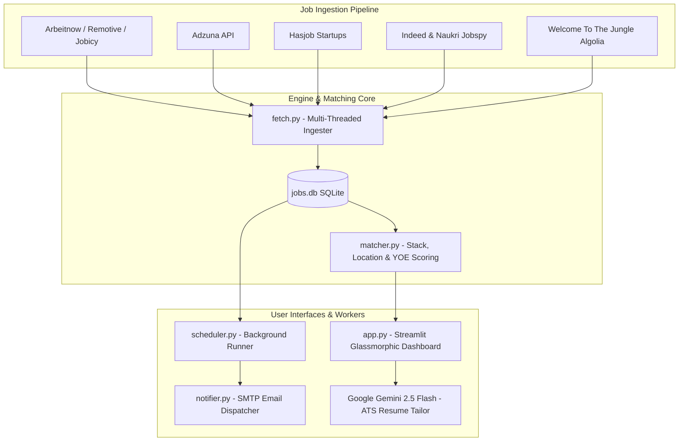

<div align="center">

# ⚡ JOBSCOUT AI • TECH JOB COPILOT
### *Autonomous Tech Job Aggregator • Multi-Factor Match Engine • Gemini-Powered ATS Tailor*

[](https://python.org)
[](https://streamlit.io)
[](https://ai.google.dev/)
[](https://sqlite.org)
[](LICENSE)

<br/>

**Tired of scrolling 10 job boards and manually tuning your resume for every ATS?**  
Job Radar aggregates openings from 7+ platforms in real-time, scores them with deterministic heuristic filters, and uses Google Gemini to tailor your resume & generate ATS-proof PDFs in seconds.

[Features](#-core-capabilities) • [Architecture](#-architecture-flow) • [Quick Start](#-quick-start) • [Configuration](#-configuration) • [Security](#-security--privacy-first)

---

</div>

## 💥 Core Capabilities

### 1. 🌐 Multi-Engine Job Aggregator
Scrapes and queries developer openings continuously without manual intervention:
- **Fast Developer APIs**: Remotive, Arbeitnow, Adzuna, Jobicy.
- **Startup Ecosystems**: Hasjob (Indian tech startups), Welcome to the Jungle (Algolia search backend).
- **Aggregator Crawlers**: Indeed & Naukri via headless `python-jobspy`.
- **Deduplication Engine**: MD5 URL and content-hash tracking prevents duplicate rows in SQLite.

### 2. 🎯 Multi-Factor Scoring Engine
No generic keyword searching. Every job is evaluated against your personalized `profile.json`:
- **Stack Score**: Matches backend, frontend, database, and tooling keywords.
- **Experience Sanity Check**: Discards jobs demanding 5–10+ years of seniority if you're early in your career.
- **Commute & Region Routing**: Filters jobs by transit lines (e.g., Western/Central Lines in Mumbai) or fully Remote tags.
- **Relevance Index**: Classifies each opening into **STRONG MATCH**, **POSSIBLE**, or **NOT ELIGIBLE**.

### 3. 🤖 Gemini ATS Resume Tailor & PDF Engine
- **Live JD Breakdown**: Inspects the target job description against your master resume.
- **AI Customization**: Reframes technical summaries and project bullet points with action verbs and target keywords.
- **1-Click PDF Compilation**: Uses `fpdf2` and `PyMuPDF` to export an ultra-clean, machine-readable ATS-compliant PDF.

### 4. ⏰ Headless Background Worker & Email Alerts
- Dedicated background worker (`scheduler.py`) continuously updates the database at your chosen interval.
- Sends **Indeed-style responsive HTML emails** with match scores, requirements breakdown, and direct apply links.

### 5. 🎛️ Dark Glassmorphic Dashboard
- Built on Streamlit with custom CSS.
- One-click filters: *Only Remote*, *Strong Matches*, *Applied*, *Shortlisted*.
- Built-in Application Tracker with status states (`Applied`, `Interview`, `Offer`, `Rejected`).

---

## 🏗️ Architecture Flow



---

## ⚡ Quick Start

### 1. Clone & Set Up Environment
```bash
# Clone the repository
git clone https://github.com/PrathameshDev2803/jobscout-ai.git
cd jobscout-ai

# Create virtual environment
python -m venv .venv

# Activate virtual environment
# Windows:
.venv\Scripts\activate
# Linux/macOS:
source .venv/bin/activate

# Install dependencies
pip install -r requirements.txt
```

### 2. Configure Environment (`.env`)
```bash
cp .env.example .env
```
Open `.env` and fill in your keys:
```env
# Gemini API Key (Get free at https://aistudio.google.com/app/apikey)
GEMINI_API_KEY=your_gemini_api_key_here

# (Optional) Adzuna API for local geo-searches
ADZUNA_APP_ID=
ADZUNA_APP_KEY=

# (Optional) SMTP Email Alerts
SMTP_HOST=smtp.gmail.com
SMTP_PORT=587
SMTP_USER=your_email@gmail.com
SMTP_PASSWORD=your_16_char_google_app_password
ALERT_RECIPIENT_EMAIL=your_email@gmail.com
EMAIL_ALERTS_ENABLED=true
ALERT_MIN_SCORE=50
```

### 3. Launch App
```bash
streamlit run app.py
```
> The app will automatically initialize `profile.json` and `resume.txt` on first launch from safe templates. You can customize them directly in the **Settings** tab.

---

## 📂 Repository Structure

```text
├── app.py                 # Streamlit UI, Glassmorphic styling, ATS Tailor & Kanban
├── fetch.py               # Ingestion pipeline & platform scrapers
├── matcher.py             # Deterministic scoring (Stack, Location, Seniority)
├── notifier.py            # SMTP HTML email template & dispatch
├── scheduler.py           # Background threading worker for auto-fetching
├── profile.example.json   # Base configuration profile template
├── resume.example.txt     # Clean plain-text master resume template
├── requirements.txt       # Production dependencies
├── .env.example           # Environment template
└── .gitignore             # Airtight protection for PII, keys, and DBs
```

---

## 🛡️ Security & Privacy First

- **Zero PII Exposure**: `profile.json` and `resume.txt` are strictly git-ignored. Your personal identity, contact numbers, and employment history stay safely on your local machine.
- **No Hardcoded Secrets**: All API keys and SMTP credentials load from `.env` or temporary session state.
- **Sanitized Templates**: Cloned instances start with mock profiles that won't break on a fresh clone.

---

## 🤝 Contributing

Contributions, issues, and feature requests are welcome!  
Feel free to check [issues page](https://github.com/PrathameshDev2803/jobscout-ai/issues).

---

## 📄 License

Distributed under the **MIT License**. See `LICENSE` for more information.

<div align="center">
  <sub>Built with ☕, Python, and relentless automation. Star ⭐ this repo if it saved you time!</sub>
</div>
